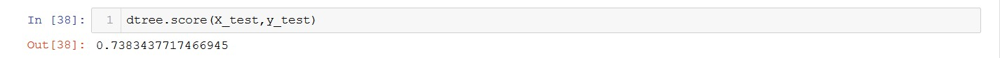
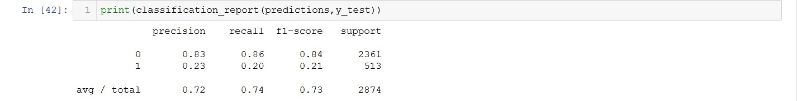
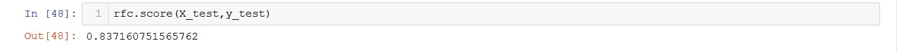
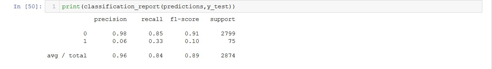

# Decision-Trees-and-RFC
Decision Trees and Random Forest Classifiers for a classification problem.                                                                         

In this notebook a real world dataset was used from [LendingClub.com](www.lendingclub.com) which contained the information about the money borrowed by people and whether the borrower paid back in full or not.                                                           

The models I used will classify whether the money was paid back in full or not and also to prove that Random Forest Classifiers perform better than Decision Trees.                                                                                                   

## Decision Trees
This model gave following performance:                                                                                                       

                                                                                                                       
**Accuracy: 75%**

## Random Forest Classifiers
This model gave the following preformance:

**Accuracy: 84%**
